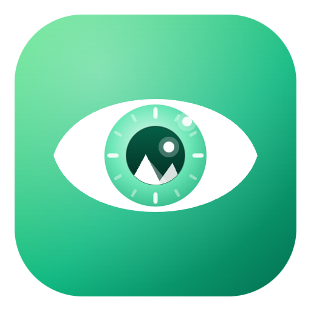
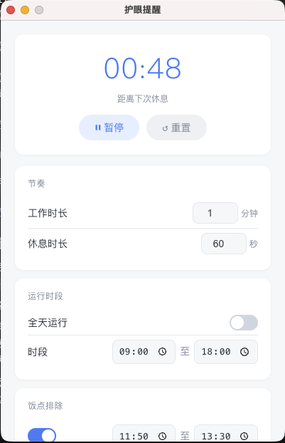
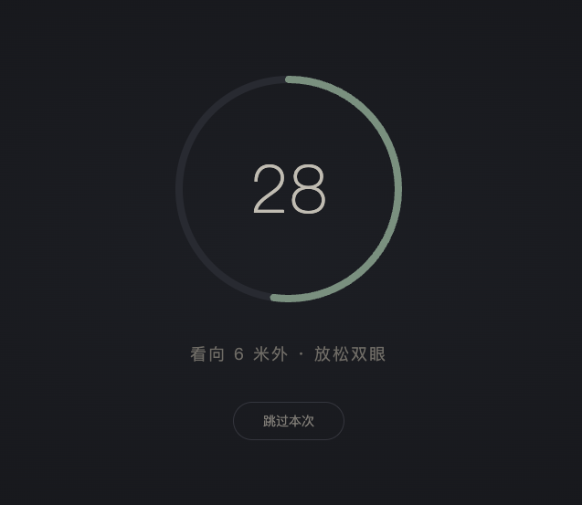
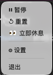

# look-far

<p align="center">
  
</p>

20-20-20 护眼提醒工具，安装后的应用名叫 **远方**。

每看屏幕 20 分钟，看向 6 米外休息 20 秒。应用待在菜单栏 / 系统托盘里，到点会弹出深色全屏遮罩，提醒你放松眼睛。

## 界面预览

<p align="center">
  
  &nbsp;&nbsp;
  
  &nbsp;&nbsp;
  
</p>

<p align="center">主界面 · 休息界面 · 菜单界面</p>

## 功能

- 菜单栏倒计时（每秒更新）
- 全屏休息遮罩，带倒计时
- 暂停 / 继续不会重置剩余时间
- 支持重置、立即休息、跳过本次休息
- 可设置工作/休息时长、运行时段、饭点排除、声音提醒
- 主题颜色：设置面板和全屏提示可分别选择浅色、深色、暖色

## 如何安装

仓库里不包含安装包（体积太大）。请把代码下载下来后自己打包。

### 1. 下载仓库

```bash
git clone https://github.com/YalongYan/look-far.git
cd look-far
```

也可以在 GitHub 页面点击绿色的 **Code → Download ZIP**，解压后再进入项目目录。

### 2. 安装依赖并打包

需要 Node.js 20+。

```bash
yarn
yarn run pack
```

只打当前系统也可以：

```bash
yarn run pack:mac   # Mac
yarn run pack:win   # Windows
```

### 3. 安装包在哪里

打包完成后，安装包在项目根目录的 **`release/`** 文件夹里：

| 系统 | 文件 |
| --- | --- |
| macOS（Apple 芯片，M1/M2/M3/M4） | `release/远方-1.0.1-mac-arm64.dmg` |
| macOS（Intel） | `release/远方-1.0.1-mac-x64.dmg` |
| Windows x64 | `release/远方-1.0.1-win-x64-setup.exe` |
| Windows ARM | `release/远方-1.0.1-win-arm64-setup.exe` |

**Mac：** 打开 DMG，把「远方」拖进「应用程序」。若提示无法验证开发者，按住 Control 点图标 → 打开 → 仍要打开。

**Windows：** 双击 `setup.exe` 按提示安装，开始菜单里会出现「远方」。

## 本地开发

```bash
yarn
yarn dev
```

启动后会出现在 macOS 菜单栏（或 Windows 托盘），点击图标打开设置。
